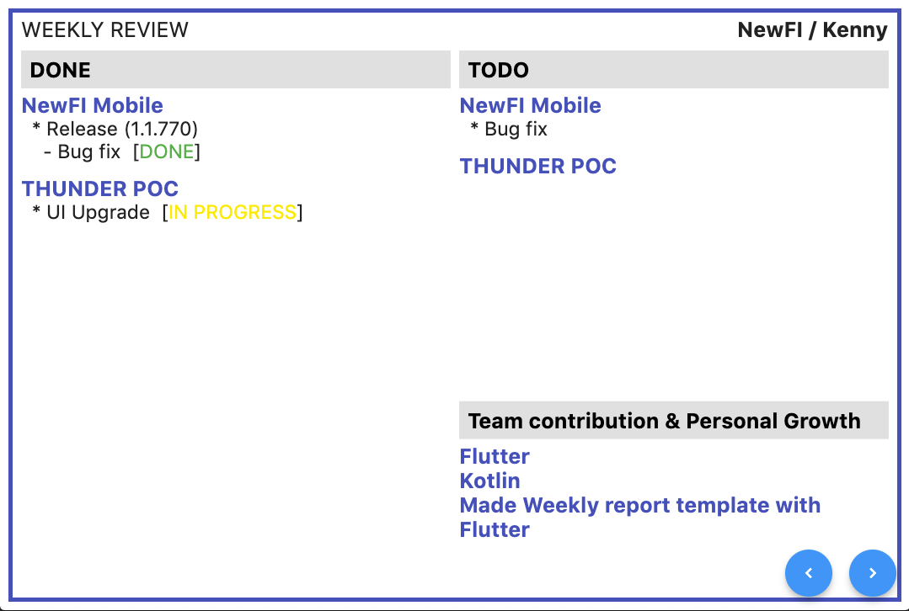
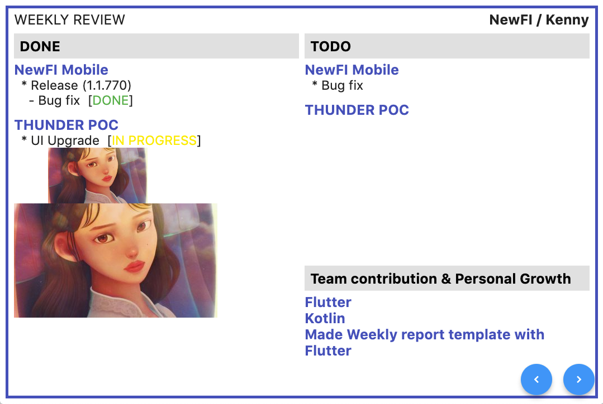

# Weekly

Weekly document for Flutter.

> To build for Chrome brower, please use `Beta` channel. Please check [Building a web application with Flutter](https://flutter.dev/docs/get-started/web) page.

## How to use

### Write your work

1. Clone this repository.
2. Open `/lib/data/users/${mysso}.dart`
3. Fill `done`, `todo` and, `etc`.

```dart
// Sample
/// Should put '\n' every single lines for line break
/// '*' and '-' are used for indent. Without those special characters, that line would be used as a group title.

WeeklyData get done => WeeklyData(
  sso: sso,
  content: "NewFI Mobile\n"
        "* Release (1.1.770)\n"
        "- Bug fix [DONE]\n"
        "\n"
        "THUNDER POC\n"
        "* UI Upgrade [in progress]\n"
  );
```



### Insert Image

1. Copy your image files under `/assets/images/${mysso}/`
2. Use special tag for image `img:{$(filename):$(width)x$(height)}` or `img:{$(filename)}` when writing your content.

```dart
WeeklyData get done => WeeklyData(
  sso: sso,
  content: "NewFI Mobile\n"
        "* Release (1.1.770)\n"
        "- Bug fix [DONE]\n"
        "img:{weekly.jpg:300x100}\n"
        "img:{weekly.jpg}\n"
  );
```



### Export PDF file

Click last page, then a PDF file is created in local storage.

* mac: `/Users/${whoami}/Library/Containers/com.example.weekly/Data/Documents/weekly.pdf`

## Functions

* Presentation
* Export a PDF file

## Known Issue

* Exported PDF file doesn't contain images.
